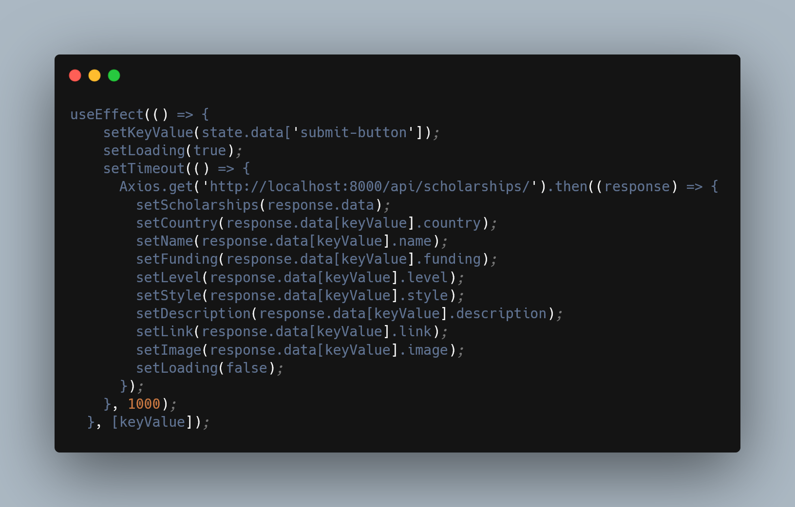
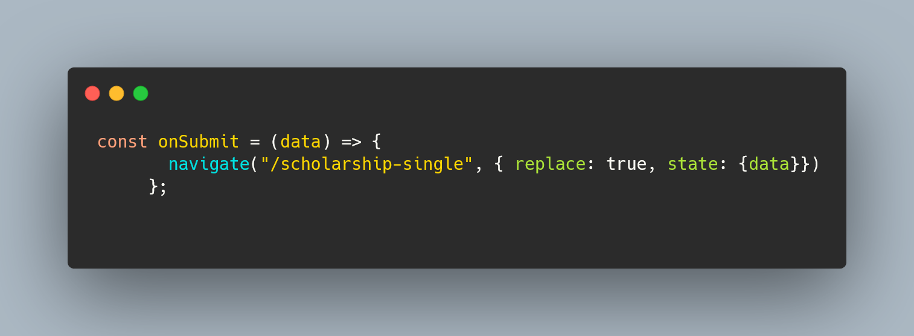

## Tech Stack

**Client:** React / React Hook Form / Axios

**Server** PHP / Laravel
## Instalation:
```bash
  npx create-react-app
```

## Utilization
This project was created as part of a startup called Easy Tramitt. This company has the mission to help Brazilian students get international scholarships abroad. Therefore, ScholarSearch helps students to find the best opportunities


## Features
- The application consumes a REST API created with the Laravel framework and all of its information is displayed on a grid-styled UI.
- The user is able to filter as well as type into the input field to find the scholarship he wants.

## File Structure for front end:

### 1. src/components
- It stores React components that are being shared throughout all of the application, in this case it is just the navbar.


### 2. src/assets
- Images that will be used in the application.
 
### 3. src/pages/main/home
- Inside this folder we can find the section of the website that loops through Laravel's REST API. Each object inside the array sent by the backend will be looped. The component being looped is called <Content/> and the API's data will be sent as props.


### 4. src/pages/hooks/filter
- In this folder, we can find a custom react hook created by me that will make the user be able to filter scholarships according to his preferences.


### 5. src/pages/content
- In this folder we can find the component that is being looped by the <Home/> component. Here, the information displayed is being received as props through its parent. An important catch here is that we will access the information of the specific scholarship that the user selected through the {key} prop in React, and not the object's id.


### 6. src/pages/individual
- This page displays specific information that the user has selected inside the <Content/> component. The data displayed here represents each index of the array of objects provided by our REST API.


### Examples of important functions.

This function can be found inside the <IndividualPages/> component and it is used to access each index of our REST API. We will access it through the prop {keyValue}, which is being passed from the <Content/> component through useForm hook from React Hook Form and useLocation hook from React Router Dom. After assigning the {keyValue} at the top of the function, the state variables shown in the UI are set. Lastly, this function has a dependency array [keyValue] specified at the end, which means the effect will run whenever the value of [keyValue] changes. This ensures that the data fetching and state updates are triggered whenever the {keyValue} changes.<br>

<br>

This function can be found inside the <Content/> component it is part of react-hook-form's API, it has "data" as its parameter. In this case, the parameter will carry only the {keyValue} variable, which will be passed to the <IndividualPages> component, which will be used to conditionally access different indexes of our REST API.


 ## React Hooks:
- useState
- useEffect
- useLocation
- useNavigation
- useForm


## Dependencies:
- axios
- react-router-dom
- react-hook-form
- react-spinners
